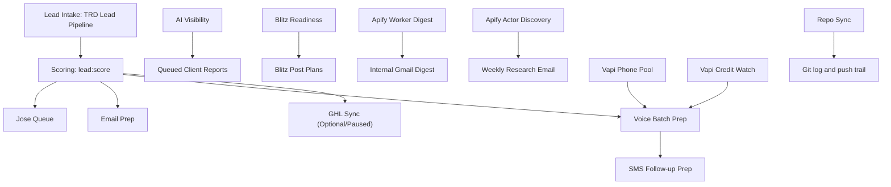

# Automation Workflow Guide

This document explains every TRD automation currently defined for this repo, what it does, why it exists, which skills it uses, what outputs it creates, and where it fits in the larger operating model.

The definitions below are based on the current automation TOML files under `/Users/jarvis/.codex/automations/`.

## 1. Automation Roster

| Automation | ID | Status | Schedule | Primary Job |
| --- | --- | --- | --- | --- |
| TRD Vapi Phone Pool | `trd-vapi-phone-pool` | ACTIVE | Weekdays 6:15 AM | Maintain a 10-number Vapi outbound pool |
| TRD Lead Pipeline | `trd-lead-pipeline` | ACTIVE | Weekdays 7:00 AM | Scrape, score, and package a live 200-lead batch |
| TRD Lead To GHL Sync | `trd-lead-to-ghl-sync` | PAUSED | Weekdays 7:10 AM | Push generated leads into GoHighLevel |
| TRD AI Visibility | `trd-ai-visibility` | ACTIVE | Weekdays 8:00 AM | Run positive monitoring and queue client reports |
| TRD Outbound Email Prep | `trd-outbound-email-prep` | ACTIVE | Weekdays 8:15 AM | Build prospecting email previews from generated leads |
| TRD Blitz Readiness | `trd-blitz-readiness` | ACTIVE | Weekdays 9:00 AM | Audit Blitz client readiness |
| TRD Blitz Post Plans | `trd-blitz-post-plans` | ACTIVE | Weekdays 9:30 AM | Produce GBP post-planning outputs |
| TRD Voice Batch Prep | `trd-voice-batch-prep` | ACTIVE | Weekdays 10:00 AM | Build the next 10-lead Vapi voice batch |
| TRD SMS Follow-up Prep | `trd-sms-follow-up-prep` | ACTIVE | Weekdays 11:00 AM | Prepare post-call SMS follow-ups |
| TRD Apify Worker Digest | `trd-apify-worker-digest` | ACTIVE | Weekdays 11:30 AM | Email Jon and Bishop the Apify health/usage digest |
| TRD Apify Actor Discovery | `trd-apify-actor-discovery` | ACTIVE | Mondays 12:30 PM | Research new useful Apify actors |
| TRD Repo Sync | `trd-repo-sync` | ACTIVE | Hourly | Export logs, commit repo changes, push to Git |
| TRD Vapi Credit Watch | `trd-vapi-credit-watch` | ACTIVE | Hourly | Export Vapi credit/runway status |
| Client Contact Announce | `client-contact-announce` | ACTIVE | One-time helper heartbeat | Internal completion email for the contact-automation milestone |

## 2. Architectural Flow

## 3. Detailed Automation Guides

## 3.1 TRD Vapi Phone Pool

### Identity

- Name: `TRD Vapi Phone Pool`
- ID: `trd-vapi-phone-pool`
- Status: `ACTIVE`
- Schedule: weekdays at 6:15 AM

### Purpose

This automation makes sure the outbound voice system begins the day with the correct phone inventory. The design target is a 10-number pool, which supports rotating call slots for generated leads.

### Skill Used

- `vapi-phone-pool-manager`

### What The Skill Does

The skill checks current Vapi number inventory and, if needed, creates additional numbers until the target pool exists. It can also attach a default assistant so the numbers are not left without a basic assignment context.

### Main Command Pattern

- `npm run vapi:numbers`
- `npm run vapi:numbers:ensure -- --count 10 --area-codes 651,540,774`

### Why It Runs First

Voice preparation later in the day depends on phone-slot availability. If the phone pool is not healthy, voice batch prep should not proceed as if it can queue 10 calls.

### Inputs

- Vapi private API credentials
- desired number count
- configured area codes

### Outputs

- updated Vapi phone inventory
- operator summary of count and creation failures if any

### Operational Notes

- This is inventory management, not campaign execution.
- It exists to prevent later voice prep from failing because the number pool is undersized.

## 3.2 TRD Lead Pipeline

### Identity

- Name: `TRD Lead Pipeline`
- ID: `trd-lead-pipeline`
- Status: `ACTIVE`
- Schedule: weekdays at 7:00 AM

### Purpose

This is the main outbound acquisition engine. It creates the day’s working lead pool from live Apify scraping, scores the leads, exports the Desktop CSV, and packages Jose’s call queue.

### Skills Used

- `gbp-lead-scraper`
- `lead-enrichment-and-scoring`
- `jose-queue-packager`
- `drive-share-operator`

### What Each Skill Does

#### `gbp-lead-scraper`

- runs the live Apify-backed scrape
- stages up to 200 tri-state high-ticket service-business leads
- saves a CSV to `/Users/jarvis/Desktop/Leads`
- preserves raw contact and social enrichment fields

#### `lead-enrichment-and-scoring`

- computes qualification/weakness signals
- creates approval items
- builds dispatch plans
- prepares the lead pool for downstream outreach work

#### `jose-queue-packager`

- turns the scored pool into a call-ready export
- preserves tri-state and high-ticket constraints
- packages a clean queue for Jose’s operational handoff

#### `drive-share-operator`

- uploads/share-jobs the generated artifacts through `gog`
- keeps the Desktop CSV local and also pushes it to Drive
- shares lead artifacts with Jon as part of the team delivery path

### Main Command Sequence

1. `npm run lead:scrape -- --client trd-outbound-prospects --worker gbp-weakness-scan --limit 200`
2. `npm run lead:score -- --client trd-outbound-prospects`
3. `npm run jose:queue -- --client trd-outbound-prospects`
4. `npm run share:drive` to upload the queued CSV/export artifacts to Drive through `gog`

### Current Real Behavior

The scrape path is now multi-account Apify aware:

- search queries are partitioned across the token pool
- actor runs execute in parallel
- results are merged
- rows are deduped by listing identity
- the runtime reports the actual count rather than inventing leads

### Inputs

- client config for `trd-outbound-prospects`
- worker config for `gbp-weakness-scan`
- Apify token pool

### Outputs

- staged lead records in SQLite
- Desktop CSV lead file
- approval items
- dispatch plans
- Jose queue export JSON
- optional Drive share jobs

### Business Importance

This automation is the source of truth for outbound prospect generation. Nearly every outbound workflow downstream depends on this run completing correctly.

## 3.3 TRD Lead To GHL Sync

### Identity

- Name: `TRD Lead To GHL Sync`
- ID: `trd-lead-to-ghl-sync`
- Status: `PAUSED`
- Schedule: weekdays at 7:10 AM

### Purpose

This automation mirrors generated leads into GoHighLevel so the CRM can be used for tag-based filtering, reference, and follow-up coordination.

### Skill Used

- `generated-lead-ghl-sync`

### What The Skill Does

- syncs locally generated leads into GHL
- tags by source/client/state/stage
- keeps GHL as a CRM-facing sink rather than the campaign source of truth

### Main Command

- `npm run lead:sync-ghl -- --client trd-outbound-prospects --limit 200`

### Why It Is Paused

The automation exists, but it is intentionally not active at the moment. That is usually the correct state when live CRM route confidence or pollution risk needs to be controlled.

### Inputs

- generated leads already staged locally
- working GHL API credentials

### Outputs

- synced contacts in GHL
- JSON export summarizing success vs failure
- share job for the TRD team

### Operator Notes

- If this is turned back on, it should happen after lead generation succeeds.
- It should never be the source used for outbound selection logic.

## 3.4 TRD AI Visibility

### Identity

- Name: `TRD AI Visibility`
- ID: `trd-ai-visibility`
- Status: `ACTIVE`
- Schedule: weekdays at 8:00 AM

### Purpose

This automation runs client-facing positive monitoring. It identifies favorable AI visibility findings, queues polished HTML reports, and suppresses client sending if contact data is incomplete.

### Skills Used

- `ai-visibility-positive-monitor`
- `client-report-dispatcher`
- `drive-share-operator`

### What Each Skill Does

#### `ai-visibility-positive-monitor`

- runs the monitoring workers for each configured client
- splits findings into positive, neutral, and negative
- keeps only positive findings ready for reporting

#### `client-report-dispatcher`

- queues the HTML report
- exposes the Gmail-ready payload
- marks the report sent only after Gmail succeeds

#### `drive-share-operator`

- shares the HTML report and supporting artifacts when Drive is available

### Main Command Sequence

1. `npm run worker:run -- --client <client-id>`
2. `npm run signal:split -- --client <client-id>`
3. `npm run report:queue -- --client <client-id>`
4. `npm run report:payload -- --client <client-id>` if sending
5. `npm run report:mark-sent -- ...` after Gmail success

### Important Guardrails

- negative findings never go into the client-facing wins email
- a client-facing send is suppressed if there is no contact record
- Gmail is used instead of SMTP

### Outputs

- raw findings
- split signals
- queued HTML report
- Gmail-ready subject/body
- optional internal “contact setup needed” announcement

## 3.5 TRD Outbound Email Prep

### Identity

- Name: `TRD Outbound Email Prep`
- ID: `trd-outbound-email-prep`
- Status: `ACTIVE`
- Schedule: weekdays at 8:15 AM

### Purpose

This automation turns generated leads into outbound HTML emails using negative AI/local visibility analysis and sends them through `gog` before the voice batch window opens.

### Skill Used

- `outbound-email-automation`

### What The Skill Does

- analyzes weaknesses for each lead
- produces the HTML outreach asset
- sends the email through `gog`
- writes a send/export JSON trail
- sends an internal recap email to Jon with Bishop copied at the end of the run
- keeps the tone direct with a light humorous touch

### Main Command

- `npm run outreach:email-send -- --client trd-outbound-prospects --limit 200`

### Inputs

- scored generated leads
- negative-analysis routines
- booking link context
- Gmail payload generation logic

### Outputs

- sent HTML artifacts in `data/reports/`
- send/export JSON in `data/exports/`
- queued share jobs

### Why It Matters

Email is the first outreach lane. It gets the message into the inbox before the call while preserving an auditable artifact tied to the lead’s actual weakness analysis.

## 3.6 TRD Blitz Readiness

### Identity

- Name: `TRD Blitz Readiness`
- ID: `trd-blitz-readiness`
- Status: `ACTIVE`
- Schedule: weekdays at 9:00 AM

### Purpose

This automation audits which Blitz-connected clients are actually ready for GBP operations versus which are blocked by missing setup requirements.

### Skills Used

- `blitz-gbp-readiness-audit`
- `drive-share-operator`

### What The Skills Do

#### `blitz-gbp-readiness-audit`

- inspects live Blitz data
- exports readiness status
- separates post-ready clients from blocked ones
- queues an internal readiness announcement

#### `drive-share-operator`

- uploads/shares readiness artifacts when Drive is ready

### Main Command

- `npm run blitz:readiness`

### Inputs

- live Blitz/Supabase data
- client/location/asset relationships
- pending actions-needed records

### Outputs

- readiness JSON export
- internal readiness HTML announcement
- optional Drive share job

### Why It Matters

This prevents TRD from treating all clients as equally ready for posting or review flows when many may still be blocked by missing URLs, assets, or connected data.

## 3.7 TRD Blitz Post Plans

### Identity

- Name: `TRD Blitz Post Plans`
- ID: `trd-blitz-post-plans`
- Status: `ACTIVE`
- Schedule: weekdays at 9:30 AM

### Purpose

This automation converts readiness into actionable post-planning. It determines which clients can support Blitz-native GBP posting and what each client’s planned post context should be.

### Skill Used

- `blitz-gbp-post-queue-manager`

### What The Skill Does

- runs post planning for a client
- checks landing URL coverage
- checks sitemap/default URL coverage
- checks approved media availability
- produces a reviewable plan rather than queueing blind live posts

### Main Command

- `npm run blitz:post-plan -- --client <client-id>`

### Outputs

- post-plan export
- client eligibility summary
- operator-ready plan for later live queueing/approval

### Key Guardrail

- this defaults to planning and review, not direct publish

## 3.8 TRD Voice Batch Prep

### Identity

- Name: `TRD Voice Batch Prep`
- ID: `trd-voice-batch-prep`
- Status: `ACTIVE`
- Schedule: weekdays at 10:00 AM

### Purpose

This automation prepares the next 10 leads for voice outreach using the Vapi system. It checks credit state first, verifies phone-slot readiness, and then builds a batch export in preview mode.

### Skills Used

- `vapi-credit-watch`
- `vapi-voice-batch-automation`

### What Each Skill Does

#### `vapi-credit-watch`

- exports Vapi credit status
- estimates runway when data exists
- determines whether dialing should pause

#### `vapi-voice-batch-automation`

- selects the next lead batch
- builds or assigns lead-specific Vapi assistant context
- maps leads into the rotating phone-number pool
- prepares batch artifacts for voice operations

### Main Command Pattern

- `npm run vapi:credits -- --export`
- `npm run voice:batch -- --client trd-outbound-prospects --batch-size 10`

### Inputs

- scored generated leads
- Vapi credit state
- Vapi phone-number inventory
- per-lead negative analysis

### Outputs

- voice batch export JSON
- updated lead voice statuses
- optional queued assistants / call payloads in live mode

### Guardrails

- if fewer than 10 numbers exist, it should stop and report
- if credits indicate a pause condition, it should stop and report
- it prepares the batch before any live dialing

## 3.9 TRD SMS Follow-up Prep

### Identity

- Name: `TRD SMS Follow-up Prep`
- ID: `trd-sms-follow-up-prep`
- Status: `ACTIVE`
- Schedule: weekdays at 11:00 AM

### Purpose

This automation prepares the post-call SMS sequence for generated leads. It follows the voice lane and references the earlier email while keeping the tone slightly comical.

### Skill Used

- `outbound-sms-followup-automation`

### What The Skill Does

- creates SMS follow-up previews
- references the earlier email
- includes the booking link
- keeps the copy light and human rather than bland

### Main Command

- `npm run sms:followup -- --client trd-outbound-prospects --limit 10`

### Inputs

- previously prepared/processed leads
- booking URL configuration
- outbound messaging copy rules

### Outputs

- SMS export artifact
- per-lead SMS status changes
- optional live send behavior when explicitly enabled

### Business Role

This is the “voice-to-text” follow-up layer. It is designed to keep momentum after voice outreach without sounding like commodity automation.

## 3.10 TRD Apify Worker Digest

### Identity

- Name: `TRD Apify Worker Digest`
- ID: `trd-apify-worker-digest`
- Status: `ACTIVE`
- Schedule: weekdays at 11:30 AM

### Purpose

This automation healthchecks the configured Apify workers after the main daily run window and emails an internal digest to Jon with Bishop copied.

### Skills Used

- `apify-worker-health-digest`
- `gmail:gmail`

### What Each Skill Does

#### `apify-worker-health-digest`

- exports worker health
- summarizes recent run status
- totals spend over 24 hours and 7 days
- queues an internal HTML announcement

#### `gmail:gmail`

- delivers the HTML digest
- allows the queued announcement to be marked sent after success

### Main Command Sequence

1. `npm run apify:healthcheck -- --queue`
2. `npm run announce:payload -- --announcement-id <id>`
3. Gmail send
4. `npm run announce:mark-sent -- --announcement-id <id> --message-id <gmail-id>`

### Current Scope

The digest now reflects the pooled Apify setup, not just a single account. It reports:

- account count
- pooled monthly credits
- worker health state
- observed spend
- direct actor usage console link

### Outputs

- Apify health JSON export
- internal HTML digest
- sent-email trace once delivered

## 3.11 TRD Apify Actor Discovery

### Identity

- Name: `TRD Apify Actor Discovery`
- ID: `trd-apify-actor-discovery`
- Status: `ACTIVE`
- Schedule: Mondays at 12:30 PM

### Purpose

This is the weekly research loop for expanding TRD’s toolset. It searches the Apify store for actors relevant to GBP, local SEO, review work, citations, and lead generation.

### Skills Used

- `apify-actor-discovery`
- `gmail:gmail`

### What The Skill Does

- searches the Apify store
- scores actor candidates
- exports the results
- queues an internal HTML summary for Gmail

### Outputs

- discovery JSON export
- internal HTML digest to Jon/Bishop

### Why It Matters

This automation keeps the stack adaptive. Instead of freezing the tooling surface, it builds a weekly habit of discovering potentially better scrapers, auditors, and vertical utilities.

## 3.12 TRD Repo Sync

### Identity

- Name: `TRD Repo Sync`
- ID: `trd-repo-sync`
- Status: `ACTIVE`
- Schedule: hourly

### Purpose

This automation gives the repo an operational paper trail. It exports the latest run summary, commits repo changes if needed, and pushes them to Git.

### Skill Used

- `repo-sync-publisher`

### What The Skill Does

- runs `log:publish`
- exports the latest log artifact
- stages repo changes
- creates a commit when appropriate
- pushes to `origin main`

### Main Command

- `npm run log:publish`

### Outputs

- run-summary JSON
- Git commit if changes exist
- pushed update to the remote repo

### Operator Value

This is the accountability layer. It keeps automation changes and log outputs visible outside the local machine.

## 3.13 TRD Vapi Credit Watch

### Identity

- Name: `TRD Vapi Credit Watch`
- ID: `trd-vapi-credit-watch`
- Status: `ACTIVE`
- Schedule: hourly

### Purpose

This automation continuously monitors the Vapi budget surface so voice workflows do not burn through credits without visibility.

### Skill Used

- `vapi-credit-watch`

### What The Skill Does

- exports a credit snapshot
- estimates runway when historical usage exists
- indicates whether dialing should pause

### Main Command

- `npm run vapi:credits -- --export`

### Outputs

- Vapi credit export
- operator summary on credit health and pause state

### Business Role

This automation is a safety valve. It allows voice operations to be constrained by cost reality rather than enthusiasm.

## 3.14 Client Contact Announce

### Identity

- Name: `Client Contact Announce`
- ID: `client-contact-announce`
- Status: `ACTIVE`
- Type: one-time heartbeat helper

### Purpose

This is a milestone/helper automation used to send an internal completion email for the client-contact automation work.

### Intended Skill

- `client-contact-completion-announce`
- Gmail connector

### What It Does

- queues the internal HTML completion email
- sends it to Bishop with Jon copied
- marks the announcement sent after delivery

### Special Note

This is not part of the ongoing daily ops chain. It is a one-off workflow helper tied to a milestone event.

## 4. How The Automations Depend On Each Other

## 4.1 Lead Automation Dependency Chain

`TRD Lead Pipeline` is upstream of:

- `TRD Lead To GHL Sync`
- `TRD Outbound Email Prep`
- `TRD Voice Batch Prep`
- `TRD SMS Follow-up Prep`

If the lead pipeline fails or returns an undersized batch, every downstream outbound-prep lane is affected.

## 4.2 Voice Dependency Chain

`TRD Voice Batch Prep` depends on:

- `TRD Vapi Phone Pool`
- `TRD Vapi Credit Watch`
- previously scored leads

If the phone pool is undersized or credits are unhealthy, the voice lane should stop safely.

## 4.3 Reporting Dependency Chain

`TRD AI Visibility` depends on:

- configured clients
- worker health
- signal splitting
- contact-roster completeness for external sends

## 4.4 GBP Planning Dependency Chain

`TRD Blitz Post Plans` depends on:

- `TRD Blitz Readiness`
- live Blitz data
- client asset and URL readiness

## 4.5 Admin Dependency Chain

`TRD Apify Worker Digest`, `TRD Apify Actor Discovery`, `TRD Repo Sync`, and `TRD Vapi Credit Watch` are governance automations. They are not direct revenue workflows, but they make the revenue workflows operationally safe and visible.

## 5. Most Important Operator Concepts

- Automations are orchestrators, not the logic itself. The actual behavior lives in skills and CLI commands.
- Anything external should be treated as queued, previewed, or confirmed, not assumed.
- The lead pipeline is upstream of all outbound work.
- Blitz readiness is upstream of trustworthy GBP execution.
- Apify and Vapi digests are budget and health guardrails, not just informational extras.
- Repo sync is part of the operating model because it preserves a change trail.
